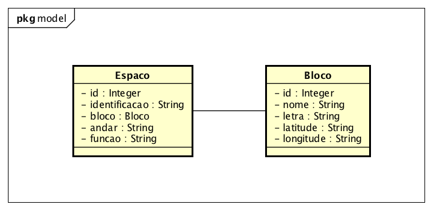

# GEU - GERENCIADOR DE ESPAÇOS UNIVERSITÁRIOS

## VERSÃO AVALIAÇÃO:

O código apresenta apenas o conteúdo visto na AVI:
* HTML
* CSS
* JavaScript
* Java
* JavaScript
* JSP
* JDBC

O projeto esta no Eclipse e esta usando o banco de dados HSQLDB em memória. Não há nenhuma necessidade de alterar a classe __Conexao.java__

* 'Caso deseje altera é por sua conta e risco.'

Para atender aos requisitos de mapeamento de espaços da universidade a primeira versão foi desenvolvida com base no diagrama de classes.



Evoluímos de acordo com a demanda para um segundo diagrama de classes.


Atualmente o sistema está executando, inserindo e listando Espaços, Blocos e Tipos.


## ALTERAÇÕES NECESSÁRIAS

Agora que o usuário já pode cadastrar os espaços ele gostaria de fazer uma reserva para uma determinada data e também consultar as reservas.


Estude o código existente e adicione a funcionalidade ligadas a Reservar um Espaço.
Crie então um novo menu Reserva com as opções de nova e listar.

O formulário de reserva deve ter no mínimo:
ESPACO (ESPACO_ID)

- TITULO DA RESERVA (TITULO)
- DESCRIÇÃO DA RESERVA (DESCRICAO)
- JUSTIFICATIVA DA RESERVA (JUSTIFICATIVA)
- SOLICITANTE DA RESERVA (SOLICITANTE)
- TELEFONE DE CONTATO DO SOLICITANTE (TELEFONE)
- DATA DA RESERVA (DATA)
- HORA DE INICIO (HORA_INICIO)
- HORA DE FIM (HORA_FIM)


Uma restrição:
* Não permita que sejam criadas 2 reservas para o mesmo dia do mesmo espaço.


- [ ] CRIE O FORMULÁRIO (JSP)
- [ ] CRIE A LISTA (JSP)
- [ ] CRIE O DAO DE RESERVA (JAVA)
- [ ] EDITE O DAO DE ESPAÇO (JAVA)
- [ ] CRIE O CONTROLLER DE RESERVA (JAVA)
- [ ] IMPLEMENTE A RESTRIÇÃO (JAVA)

DICAS:
Use o Tipo java.time.LocalDate para data
Use o Tipo java.time.LocalTime para hora inicio e hora fim

### Conversão

```Java


//Obtendo do Banco um java.sql.Date e convertendo para java.time.LocalDate
r.setData(rs.getDate("data").toLocalDate());
//Obtendo do Banco um java.sql.Time e convertendo para java.time.LocalTime
r.setHoraInicio(rs.getTime("hora").toLocalTime());


//Convertendo de uma String "21/10/2017" para um java.time.LocalDate
//import java.time.format.DateTimeFormatter;
DateTimeFormatter dateFormat = DateTimeFormatter.ofPattern("dd/MM/yyyy");
String data = "21/10/2017";
r.setData(LocalDate.parse(data, dateFormat));

//Convertendo de uma String "13:59" para um java.time.LocalDate
DateTimeFormatter timeFormat = DateTimeFormatter.ofPattern("H:mm");
String hora = "13:59";
r.setHora(LocalTime.parse(hora, timeFormat));


//Convertendo de um java.time.LocalDate para um java.sql.Date para inserir no Banco de dados
ps.setDate(1, java.sql.Date.valueOf(r.getData()));

//Convertendo de um java.time.LocalTime para um java.sql.Time para inserir no Banco de dados
ps.setTime(2, java.sql.Time.valueOf(reserva.getHora()));

```


Para usar o novo esquema do banco basta remover as marcas de comentário da RESERVA.
